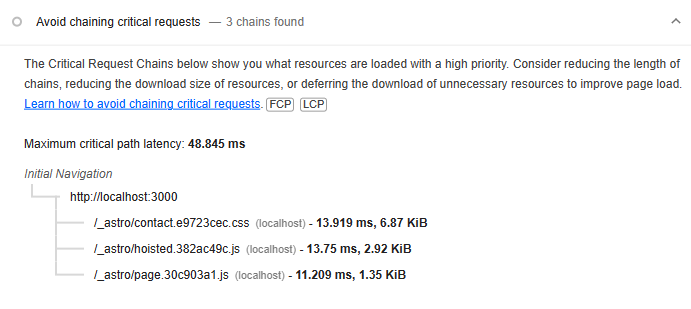

Custom [client directives](https://docs.astro.build/en/reference/directives-reference/#custom-client-directives) are useful when you want more control over when framework components or [islands](https://docs.astro.build/en/concepts/islands/) hydrate in an Astro site. A direct benefit is potentially improved page performance by only loading scripts when they're actually needed.

## Use case

It's common to have two navigation menus - one for mobile and one for desktop. If the mobile navigation is toggleable, `client:visible` can be used, so it hydrates at a low priority. 

However, if the desktop navigation has dropdown menus that don't need to hydrate at all even when visible, then that component could use hover or `mouseover` based client directive instead, so it only hydrates based on a user action.

For example, I used this at [vsctrust.org.nz](https://vsctrust.org.nz). Using `client:visible` in a local production build:


Using `client:mouseover`:



Did it improve the performance to a level where I could perceive it? No, but it was a fun exercise, and maybe doing something like this would make a real difference on a heavier page, especially on older devices.

## Creating a custom client directive

We'll look at creating a custom hover or `mouseover` client directive.

Somewhere in your Astro project, (like a `lib` folder or similar), create a folder called `client-directives`. In this folder, create a `mouseover.js` file and add:

```js title="mouseover.js"
/**
 * @type {import('astro').ClientDirective}
 */
export default (load, opts, element) => {
  element.addEventListener(
    "mouseover",
    async () => {
      const hydrate = await load();
      await hydrate();
    },
    { once: true }, // remove the event listener 
  );
};
```

This will hydrate the component once the `mouseover` event is triggered on the element.

Then add this directive as an Astro integration. Create a `register.js` file and add:

```js title="register.js"
/**
 * @type {() => import('astro').AstroIntegration}
 */
export default () => ({
  name: "client:mouseover",
  hooks: {
    "astro:config:setup": ({ addClientDirective }) => {
      addClientDirective({
        name: "mouseover",
        entrypoint: "./src/lib/client-directives/mouseover.js",
      });
    },
  },
});
```

We'll also add types for the directive. Create an `index.d.ts` file and add:

```ts title="index.d.ts"
import "astro";
declare module "astro" {
  interface AstroClientDirectives {
    "client:mouseover"?: boolean;
  }
}
```

For WebStorm at least, this doesn't seem to affect any of the types or warnings that are picked up once you use a custom client directive, but it doesn't hurt to add this anyway.

## Bringing it all together

Finally, we'll add the client directive to our Astro config:

```js title="astro.config.mjs"
import mouseoverDirective from "/src/lib/client-directives/register";

export default defineConfig({
  integrations: [
    mouseoverDirective(),
    // ...
  ],
});
```

We can add it to any component like so:

```astro title="*.astro"
<ReactComponent client:mouseover />
<!-- You may get warnings about using it in your IDE (for example, that it requires a value in WebStorm), you could explicitly pass it a value of `true` (which doesn't affect anything but removes the warning) or just leave it. -->
```


```tsx title="ReactComponent.tsx"
import { useEffect } from "react";

export function ReactComponent() {
  useEffect(() => {
    const content = document.querySelector("#content");
    if (content) content.textContent = "Hydrated";
  }, []);

  return <div id="content">Hover over me</div>;
}
```

Then restart your development server for the client directive to be loaded.

To see if it's working, open up your browser's network tab, and check if this component's scripts are fetched once you hover over it. 


You may not ever need to use a custom client directive, but it's a pretty cool feature that highlights Astro's flexibility.