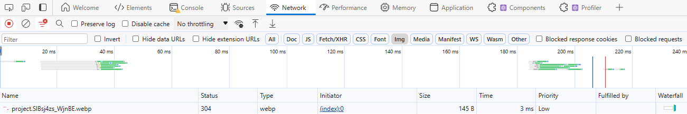

It is fairly straightforward to preload images in an Astro site that are served from your `public` folder - you just need to get the path to the image, and add it to a `link rel="preload"` tag:

```html title="*.astro"
<head>
  <link rel="preload" href="/image.png" as="image" /> <!-- /public/image.png -->
</head>
```

But how do you preload images that are loaded with the [Image](https://docs.astro.build/en/guides/images/#image--astroassets) or [Picture](https://docs.astro.build/en/guides/images/#picture-) components if you need them to be optimized? There's no simple way to do this, like with Next.js's Image [priority feature](https://nextjs.org/docs/pages/api-reference/components/image#priority).

But you can use Astro's [getImage](https://docs.astro.build/en/guides/images/#generating-images-with-getimage) function to generate an optimized image server-side (or during the build for static sites), and use this image's path in the preload's href and on the page (as an `` or `picture>`) instead.

## Example

In this example, we'll preload an image from our `/src/assets` folder called `project.png`.

Start by importing the `getImage` function and the image in an Astro page or component:
```astro title="*.astro"
---
import { getImage } from "astro:assets";

import image from "../assets/project.png".
const optimizedImage = await getImage({
  src: image,
  format: "webp",
  width: 500,
  height: 500,
});
---
```

To use this optimized image, we can use a normal `` tag:
```astro

```

You can also still use the `<Image />` component, which will be transformed into a normal `` without optimizing the image (due to the use of `src` or an image path string):

```astro
<Image
  src={optimizedImage.src}
  width={500}
  height={500}
  alt=""
/>
```

Finally, add `preload` tag with the image to your page's head element:

```astro title="*.astro"
<head>
  <link rel="preload" href={optimizedImage.src} as="image" />
</head>
```

If you're using a layout with an existing `<head>`, then you can use [named slots](https://docs.astro.build/en/core-concepts/astro-components/#named-slots) to pass in the link tag from another page or component without creating duplicate `<head>` tags:

```astro title="Layout.astro"
<head>
  {/* ... */}
  
  <slot name="head" />
</head>
```

```astro title="*.astro"
<Fragment slot="head">
  <link rel="preload" href={optimizedImage.src} as="image" />
</Fragment>
```

### Content Collections

If you're using content collections, and you're including images in the [collection schema](https://docs.astro.build/en/guides/images/#images-in-content-collections), then you can reference this image directly:

```astro title="[slug].astro"
---
import { getImage } from "astro:assets";

/* export async function getStaticPaths() { ... }, etc. */

const { project } = Astro.props;
const optimizedImage = await getImage({ src: project.data.image });
---
```

## Bringing it all together

To check that the preloading worked correctly, you can build your site and run it locally - change the commands as needed based on your package manager.

For `static` sites, run `npm run build` and then `npm run preview`.

For `hybrid` or `server` sites, you should be able to use the [Node.js adapter](https://docs.astro.build/en/guides/integrations-guide/node/) (even if you're using another adapter like for Vercel or Netlify, just swap them out for testing). Run `npm run build` and then `npm run preview`.

There doesn't seem to be a simple built-in way of checking preloaded resources. But if you open your browser's network tab and filter for images, the preloaded image should be at or near the top of all requests:



You can also remove the filter to see how it compares with all other request types, or re-build with the preload removed to see how it changes .

Make sure to also check the page source - the paths in the `<link>` tag and `` tag should match:
```html
<link rel="preload" href="/_astro/project.xCZHVmaS_29nlmI.webp" as="image">


```


Also, if you're using Chrome or Edge, you'll get a warning in your console after a few seconds if it didn't work - `The resource *.webp was preloaded using link preload but not used within a few seconds ...`. Other browsers may do something similar.

## View Transitions

If you're using [View Transitions](https://docs.astro.build/en/guides/view-transitions/) and animations between images, preloading should also help prevent the image flickering as it's loaded for the first time as you navigate to the new page.

For example, if you have a product carousel with small images linking to product pages with a larger resolution of the same image, you may want to preload these larger images.

Otherwise, it can look jarring when the image loads during the element's transition to the next page. Preloading the image should help with this. Alternatively, you could use the same image between pages if you're willing to sacrifice flexibility with the optimizations e.g. width and height.

Keep in mind that preloading isn't a guarantee for improving things, and may actually make your page performance worse. But the example in this post is a reasonable solution if you feel the need to use preloading or other optimization techniques.