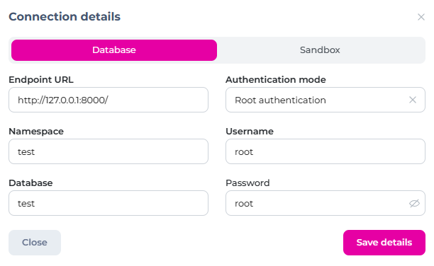

## Overview

This tutorial will cover how to authenticate using a third-party provider with [SurrealDB](https://surrealdb.com/). We'll use a Next.js app with [Auth.js](https://authjs.dev/) to do this, and Google as the provider. Uuers will be able to authenticate with their Google account, sign in to SurrealDB, and create and edit their own posts.

For another third-party like GitHub, you can use [another provider](https://next-auth.js.org/providers/) and adjust the code (linking the third-party account and the user together).

### Flow

1. user signs in with their Google account
2. sign in as an existing SurrealDB user linked to this Google account - if it doesn't exist, create the user
3. display any existing posts and controls to add/edit posts
4. when the user wants to create or edit a post, the backend will sign in as this user temporarily to authorize the change

## Prerequisites

1. [Next.js + Auth.js starter project](https://github.com/nextauthjs/next-auth-example) (or use your own)
2. SurrealDB database - [follow this tutorial](https://surrealdb.com/install) on setting one up locally
3. Get Google OAuth credentials - [instructions here](https://developers.google.com/identity/protocols/oauth2)
   1. create a `Web` OAuth Client
   2. add `http://localhost:3000/api/auth/callback/google` as an authorized redirect URI
   3. copy the Client ID and Client Secret for later

## SurrealDB Setup

We will run some queries to set up our tables and [users scope](https://surrealdb.com/docs/surrealql/statements/define/scope). Scopes are a way to permissions on any table without complex configuration.

Run the following two queries - we can do this with [Surrealist](https://surrealist.app) in a browser.



### users table

Running this query will:
- set permissions - records can only be changed by their user
- define table fields, and make `sub` and `email` unique across all users
- set up the users scope

```sql
DEFINE TABLE users SCHEMAFULL
	PERMISSIONS
		FOR select, update, delete WHERE id = $auth.id;

DEFINE FIELD sub ON users TYPE string;
DEFINE FIELD name ON users TYPE string;
DEFINE FIELD email ON users TYPE string ASSERT string::is::email($value);
DEFINE FIELD picture ON users TYPE string;

DEFINE INDEX sub ON users COLUMNS sub UNIQUE;
DEFINE INDEX email ON users FIELDS email UNIQUE;

DEFINE SCOPE users
  SESSION 1d
  SIGNUP (CREATE users SET sub = $sub, email = $email, name = $name, picture = $picture)
  SIGNIN (SELECT * FROM users WHERE sub = $sub AND email = $email)
;
```

The Google profile contains a `sub` value which is a unique identifier for every account. If there's a better way of doing things, let me know.

### posts table

Running this query will:
- set permissions - posts can only be changed by their user
- define table fields
- create a `users` relation

```sql
DEFINE TABLE posts SCHEMAFULL
  PERMISSIONS
		FOR create, update, delete WHERE users = $auth.id;

DEFINE FIELD content on posts TYPE string;
DEFINE FIELD users ON posts TYPE record (users) ASSERT $value IS NOT NONE;
```

## App Setup

### Setting up Google authentication

In your `env.local` file, add these variables (changing any values as required):

```bash
NEXTAUTH_URL=http://localhost:3000
NEXTAUTH_SECRET=yoursecret
SURREAL_ENDPOINT=http://localhost:8000
SURREAL_NAMESPACE=test
SURREAL_DATABASE=test
SURREAL_USERNAME=root
SURREAL_PASSWORD=root
GOOGLE_CLIENT_ID=yourclientid
GOOGLE_CLIENT_SECRET=yourclientsecret
```

Install the [SurrealDB SDK](https://surrealdb.com/docs/integration/sdks/javascript):

```shell
npm install surrealdb.js
```

Create a `surrealdb.ts` file in a `lib` (or similar) folder and add:

```typescript
import { Surreal } from "surrealdb.js";

const connectionString = process.env.SURREAL_ENDPOINT!;
const namespace = process.env.SURREAL_NAMESPACE!;
const database = process.env.SURREAL_DATABASE!;
const username = process.env.SURREAL_USERNAME!;
const password = process.env.SURREAL_PASSWORD!;

const db = new Surreal();

db.connect(`${connectionString}/rpc`, {
   namespace,
   database,
   auth: { username, password },
});

export { db };
```

We will import this SurrealDB client whenever we need to use our database.

Open `api/auth/[...nextauth].ts` and add the code for Google:

```typescript
import NextAuth, { type NextAuthOptions } from 'next-auth'

import GoogleProvider from 'next-auth/providers/google'
import { db } from '@/lib/db'

export const authOptions: NextAuthOptions = {
   adapter: SurrealDBAdapter(clientPromise),
   providers: [
      GoogleProvider({
         clientId: process.env.GOOGLE_CLIENT_ID!,
         clientSecret: process.env.GOOGLE_CLIENT_SECRET!
      })
   ],
   session: { strategy: 'jwt' },
   callbacks: {
      async jwt({ token, account, profile }) {

         if (profile) {

            token.googleSub = profile.sub

            try {
               await db.signin({
                  namespace,
                  database,
                  scope: 'users',
                  sub: profile.sub,
                  email: token.email
               })
            } catch {
               // otherwise sign up
               await db.signup({
                  namespace,
                  database,
                  scope: 'users',
                  sub: profile.sub,
                  name: token.name,
                  email: token.email,
                  picture: token.picture
               })
            }

         }

         return token
      }
   }
}

export default NextAuth(authOptions)
```

### Optional
Auth.js has a [SurrealDB adapter](https://authjs.dev/reference/adapter/surrealdb) - using this will create a new record in the `account` and `user` tables for every sign-in as a part of their [database model](https://authjs.dev/getting-started/adapters#models). This is optional as we're not using this data or any of the helper functions this adapter provides.

## Summary

In the future, there will likely be official integrations or code available to make third-party authentication easier.

Let me know if you have any suggestions or questions, or if there's anything missing or incorrect.